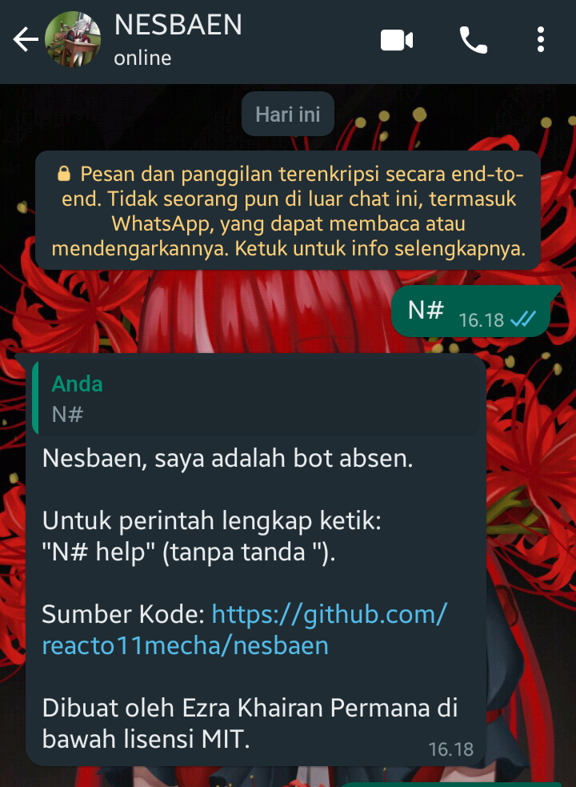
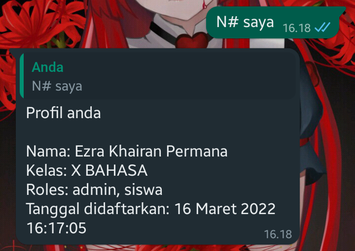
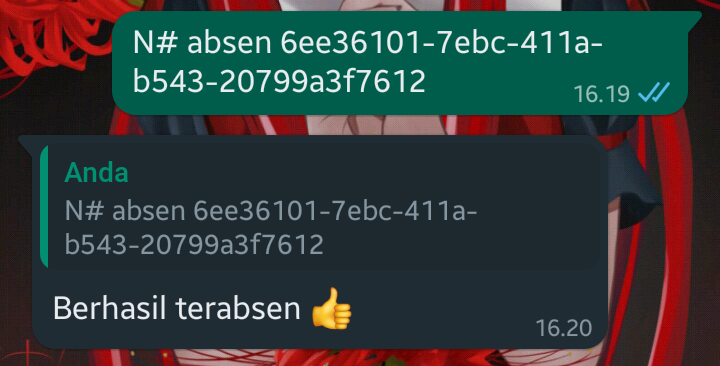
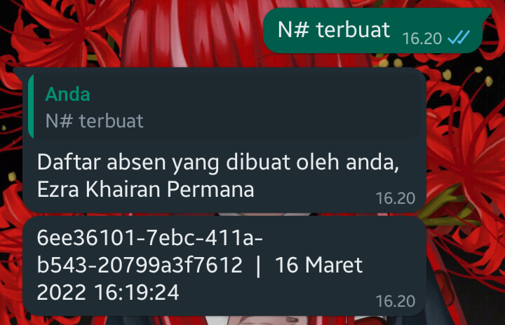
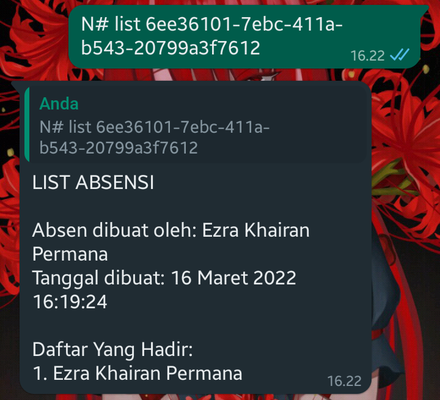
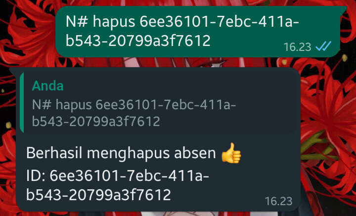

# NESBAEN

Ini adalah aplikasi absen berbasis bot whatsapp, kata dasar nesbaen adalah absen. Aplikasi ini memiliki fitur untuk mengabsen dan membuat absensi baru lewat whatsapp secara otomatis dengan sistem user yang terdaftar.

## Latar belakang bot ini dibuat

1. Jika absen di whatsapp secara biasa tidaklah efisien, menunggu teman dan menyalin daftar absensi yang sebelumnya dan mengetikan nama, padahal data absensi sudah ada di daftar absen sekolah.
2. Kasus "gw duluan" dalam absen itu menganggu apalagi terkadang menimbulkan keributan, padahal hal seperti ini adalah hal yang sepele.
3. Mengisi google form dengan kolom tanggal dan waktu secara berulang-ulang setiap harinya adalah hal yang buang-buang waktu. Terkadang pengaturan moderasinya tidak selalu benar dan menganggu konsentrasi siswa saat belajar.

## Prerequisites

Anda butuh

- Node.js Dan NPM
- MongoDB untuk menyimpan data
- Handphone tak terpakai (opsional, direkomendasikan)

## Pemakaian

### Ikhtisar Daftar Perintah

Berikut daftar perintah yang sudah dibuat.

| **Nama Perintah** |                                                                                                                                                                           **Deskripsi Penggunaan**                                                                                                                                                                            |  **Contoh**   |
| :---------------: | :---------------------------------------------------------------------------------------------------------------------------------------------------------------------------------------------------------------------------------------------------------------------------------------------------------------------------------------------------------------------------: | :-----------: |
|       saya        |                                                                                                                                                          Perintah ini digunakan untuk mengecek profil diri sendiri.                                                                                                                                                           |    N# saya    |
|       buat        |                                                                                        Perintah ini digunakan untuk membuat absen, gunakan secara bijak. <br>Anda harus memiliki role pengurus/guru/admin.<br><br>Jika sudah diberikan id uniknya, berikan ke orang/kelas yang dituju.                                                                                        |    N# buat    |
|       list        |                                                                                                      Perintah ini digunakan untuk menampilkan siapa saja yang sudah absen, <br>diperlukan argumen "id" yang unik. <br><br>Anda harus memiliki role pengurus/guru/admin.                                                                                                       | N# list <id>  |
|      terbuat      | Perintah ini digunakan untuk mendapatkan list daftar absen yang pernah dibuat oleh anda. <br>Diperlukan role pengurus/guru/admin. List absensi bisa didapatkan oleh orang <br>yang membuat beberapa absen sebelumnya.<br><br>Misal<br>"A" telah membuat 3 absen, jika "A" memanggil perintah ini maka dia <br>bisa mendapatkan daftar 3 absen yang ia pernah buat sebelumnya. |  N# terbuat   |
|       hapus       |                                Perintah ini digunakan untuk _menghapus_ absen, diperlukan argumen "id" yang unik. <br>Anda harus memiliki role pengurus/guru/admin. <br>Yang bisa menghapus absen adalah orang yang membuatnya.<br><br>Catatan: **Hati-hati** dalam menggunakan perintah ini. Sekali terhapus sudah terhapus untuk selamanya.                                 | N# hapus <id> |

Atau gunakan `N# help` pada saat bot sudah hidup.

### Cloning dari Github

Jalankan perintah ini Command Line.

```sh
# https
git clone https://github.com/reacto11mecha/nesbaen.git

# SSH
git clone git@github.com:reacto11mecha/nesbaen.git
```

### Menginstall package

Anda ke root directory project dan menjalankan

```sh
npm install
```

### Menjalankan Aplikasinya

Pertama-tama, copy file `env.example` menjadi `.env` dan isikan value yang sesuai.

> Saran, prefix dari bot nya tidak usah diubah.

Kedua, copy folder `example` menjadi `sensitive` dan isikan file dengan file excel yang sesuai yang sesuai.

---

Ada aturan dalam penulisan file xlsx, diantaranya.

1. File yang digunakan harus berekstensi/berakhiran `.xlsx`
2. Nama file yang dipakai harus menggunakan huruf kapital
3. Isikan file tersebut hanya dengan satu sheet
4. Nama sheet harus sama dengan nama file (tanpa ekstensi `.xlsx`)
5. Nama guru atau siswa harus ditulis dengan huruf kapital
6. Penulisan nomor telepon harus dengan format kode telepon +62, cara mudahnya lihat kontak seseorang lewat info whatsapp
7. Tulisan di excel harus menggunakan `'.62XXXX`. Di hapus tanda `-` dan hilangkan spasi.

> Jalan mudahnya tinggal ikuti file contoh yang sudah ada

---

Format penamaan file excel. Ada beberapa penamaan yang bisa digunakan.

1. `GURU.xlsx`: Untuk daftar nama guru dengan nomor teleponnya
2. `(TINGKATAN KELAS DALAM HURUF ROMAWI KAPITAL) (NAMA KELAS, misal BAHASA).xlsx`: Ini adalah nama file yang dinamis dengan catatan tingkatan kelas dengan nama kelas harus ada di database, misal `X BAHASA.xlsx`, `X IPA 5.xlsx`, `X IPS 2.xlsx`.

> Jalan mudahnya tinggal ikuti file contoh yang sudah ada

---

Untuk menjalankan botnya, pastikan mongodb sudah hidup dan url-nya benar.

```sh
npm start
```

Jika baru pertama kali menjalankan, scan barcode di terminal untuk dihubungkan ke whatsapp di handphone.

### Contoh Pemakaian

Ini adalah contoh pemakaian dari nesbaen, dibawah ini screenshot pemakaiannya. Pertama, pemanggilan bot menggunakan `N#` biasa, akan menampilkan perintah yang kurang lebih sama seperti `N# help`.



Mengecek profil diri sendiri menggunakan `N# saya`. Jika tidak terdaftar maka tidak akan menampilkan profil dan akan mengirimkan bahwa yang mengirimkan pesan tidak terdaftar.



Jika memiliki role pengurus/guru/admin maka bisa menggunakan perintah `buat` untuk membuat absen, nanti akan dikirimkan pesan berupa absen dan id dari absennya.


Karena pesan sebelumnya sudah mengirimkan pesan absen beserta id nya. Maka dengan mudah kita tinggal menyalin atau meneruskan pesannya ke bot.



Jika kamu telah membuat absen sebagai role yang sudah disebutkan sebelumnya dengan nomor telepon yang sama, kamu bisa mengecek absen yang sudah-sudah sebelumnya dengan menggunakan `N# terbuat`.



Jika sebelumnya itu absen menggunakan id yang telah diberikan, orang dengan role yang sudah disebutkan bisa mengecek siapa saja yang sudah absen dengan id tertentu. Gunakan `N# list <id>` untuk mengecek siapa saja yang sudah absen, contohnya seperti dibawah ini.



Menghapus absensi yang sudah dibuat bisa menggunakan `N# hapus <id>`. Yang bisa menghapus adalah orang yang memiliki ketiga role khusus dan orang yang membuat absensi dengan id yang sama.



### Deploy ke Heroku

Jika ingin mendeploy ke heroku, klik tombol dibawah ini.

[](https://heroku.com/deploy?template=https://github.com/reacto11mecha/nesbaen/)
